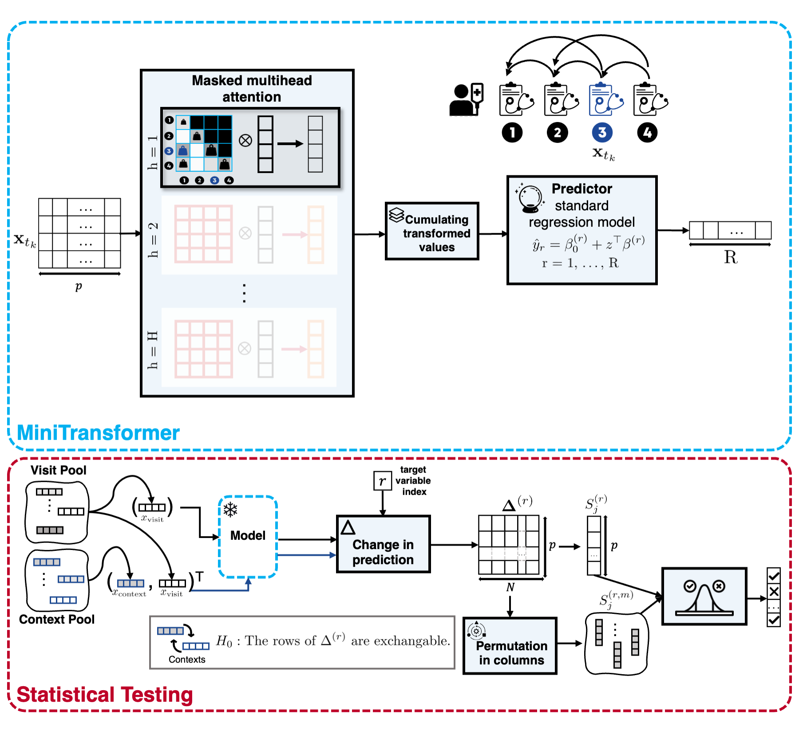

## MiniTransformer: A Minimalist Transformer for Small-Sample Sequential Data

A PyTorch implementation of the MiniTransformer, a compact Transformer architecture designed for small-sample clinical and behavioral data. The model balances predictive performance with interpretability by combining architectural simplifications with a built-in framework for statistical testing.



## Overview

This project implements a custom transformer architecture (`MiniTransformer`) that learns patterns in sequential data, particularly focusing on:

- **Feature Interactions**: Understanding how different features at various positions influence predictions
- **Statistical Testing**: Rigorous evaluation of learned patterns with significance testing
- **Context Effects**: Analysis of how historical context affects future predictions

## Architecture

The `MiniTransformer` consists of:

- **Multi-Head Attention**: Custom attention mechanism with positional encodings
- **Distance Matrices**: Incorporates both pairwise distances and distance-to-end information
- **Custom Masking**: Specialized attention masks for prediction tasks
- **Statistical Analysis**: Built-in tools for evaluating feature importance and interactions

## Key Features

### 1. Data Handling
- **Simulated Data**: Generates synthetic sequential data with controllable patterns
- **Real Data**: Supports real-world datasets (GHQ health questionnaire data)
- **Variable Length Sequences**: Handles sequences of different lengths with proper padding

### 2. Model Components
- Multi-head attention with customizable heads, key/value dimensions
- Position-aware attention using distance matrices
- Cumulant-based feature aggregation
- L2 regularization with bias exclusion

### 3. Evaluation & Analysis
- Multiple baseline comparisons (average, informed, repeat baselines)
- Regression baseline using scikit-learn
- Statistical significance testing with p-value computation
- Context-target effect visualization

## Installation

1. Clone the repository:
```bash
git clone github.com:kianaf/MiniTransformer.git
cd mini_transformer
```

2. Create and activate virtual environment:
```bash
python -m venv env
source env/bin/activate  # On Windows: env\Scripts\activate
```

3. Install dependencies:
```bash
pip install -r requirements.txt
```

## Usage

### Basic Training

Run the main training script:

```bash
python main.py
```

### Configuration

Key hyperparameters can be modified in `main.py`:

```python
# Data configuration
data_str = "simulation"  # or "ghq_sum", "ghq_b_sum"
batch_size = 1
n = 200                  # Training samples
p = 10                   # Number of features
maxlen = 10              # Maximum sequence length

# Model architecture
nheads = 16              # Number of attention heads
ncum = 2                 # Number of cumulants
dk = 1                   # Key dimension
dv = 1                   # Value dimension

# Training
learning_rate = 1e-3
lambda_l2 = 1e-3
EPOCHS = 100
```

### Jupyter Notebooks

Explore the analysis notebooks in the `notebooks/` directory:

- `simulation_experiments.ipynb`: Basic simulation experiments
- `simulation_experiments_statistical_testing.ipynb`: Statistical analysis of simulated data
- `real_data_experiments_D1.ipynb`: Real data analysis (Dataset 1)
- `real_data_experiments_D2.ipynb`: Real data analysis (Dataset 2)
- `real_data_experiments_pbc2.ipynb`: PBC2 cohort (Mayo Clinic primary biliary cirrhosis, `survival::pbcseq`)

### Revision experiments (response to reviewer)

Scripts under `notebooks/` that produce the new appendices and §3.1.2
controlled-simulation results in the revised manuscript:

- `prepare_pbc2.py`: extracts `survival::pbcseq` via Rscript and binarises it
  at clinical thresholds. Output: `data/pbc2/pbc2_binarised.csv`.
- `run_baselines_simulation.py`, `run_baselines_real_data.py`: 10-seed /
  10-fold §3.1 baseline comparison (MiniTransformer vs iTransformer,
  ScaledVanilla, KernelAttentionNoDecay, DLinear).
- `null_calibration.py`: 500-rep permutation-test calibration on the
  simulation (Appendix S2 histograms and Q-Q plots).
- `v_monotonicity_check.py`, `v_monotonicity_check_lora.py`,
  `v_monotonicity_check_pbc2.py`: V-sweep across V ∈ {5, 6, 7} on each cohort
  (Appendices S3-S5).
- `gamma_sensitivity.py`: γ ∈ {1, 2, 5, 10, learned} sweep on the
  simulation and LORA D1/D2 (Appendix S8).
- `pbc2_controlled_simulation.py`: the §3.1.2 controlled simulation on real
  binarised PBC2 (see below).

#### §3.1.2 — PBC2 controlled simulation

`pbc2_controlled_simulation.py` builds a controlled simulation on top of
the real binarised PBC2 cohort: the 9 predictor columns are kept exactly
as they appear in `data/pbc2/pbc2_binarised.csv` (no modification), and
the `ascites` column is overwritten with a synthetic binary target
generated by the same j1→j2→j3 rule as the synthetic simulation:

- **j1 = `bili_high`** (real binary column, index 8)
- **j2 = `albumin_low`** (real binary column, index 3)
- **j3 = synthetic `y_t`** (overwrites the `ascites` column at index 9)
- y_t = 1 with probability 0.9 when the j1→j2 trigger sequence has fired
  at start of step t with no firing of y_t in between; otherwise 0.
  Reset-on-fire: when y_t = 1, the trigger flags reset.

The remaining seven binarised markers (`hepatomegaly`, `spiders`,
`edema_present`, `alkphos_high`, `ast_high`, `platelet_low`,
`protime_high`) are not direct inputs to the rule but share real PBC2
correlations with the triggers through PBC clinical biology. The §2.3
test should therefore rank the triggers above the other seven even
though those carry indirect signal through the disease.

Run with:

```bash
python notebooks/pbc2_controlled_simulation.py
```

Configuration knobs (environment variables, all optional):

| variable          | default | meaning                              |
|-------------------|---------|--------------------------------------|
| `PBC2_SIM_EPOCHS` | 150     | training epochs per fold             |
| `PBC2_SIM_V`      | 7       | visit-sample size for the §2.3 test  |
| `PBC2_SIM_NREPP`  | 500     | permutation-test repetitions          |

Protocol: 10-fold CV with `random_state=42`, one paper-seed per fold from
the standard list. Target's marginal positive rate ≈ 9% (matches real
ascites prevalence). Runtime ≈ 25-40 min on CPU.

**Locked-in results (synthetic target, 10-fold CV, V=7, nrepp=500):**

- `MSE_target = 0.0974 ± 0.0184` (model learns the rule; beats the
  marginal baseline of ≈ 0.081, so the §2.3 guideline applies).
- §2.3 ranking by mean p-value across folds:

  | rank | variable        | mean p | role         |
  |------|-----------------|--------|--------------|
  | 1    | `bili_high`     | 0.067  | **trigger**  |
  | 2    | `albumin_low`   | 0.334  | **trigger**  |
  | 3    | `ast_high`      | 0.507  | non-trigger  |
  | 4    | `edema_present` | 0.531  | non-trigger  |
  | 5    | `alkphos_high`  | 0.536  | non-trigger  |
  | 6    | `spiders`       | 0.551  | non-trigger  |
  | 7    | `platelet_low`  | 0.552  | non-trigger  |
  | 8    | `hepatomegaly`  | 0.558  | non-trigger  |
  | 9    | `protime_high`  | 0.582  | non-trigger  |

  Both triggers occupy the top two ranks; the seven non-triggers cluster
  conservatively above 0.5 (the empirical-null-contamination behaviour
  documented in Appendix S2). No non-trigger had any fold reject at
  α = 0.05.

Outputs (`notebooks/results/pbc2_controlled_simulation/`):

- `summary.txt` — human-readable summary.
- `mse.csv` — per-variable MSE table.
- `test.csv` — §2.3 mean p-value per variable, ranked.
- `marginal.txt` — synthetic target's positive rate.
- `run.log` — full stdout from the run.

## Project Structure

```
mini_transformer/
├── main.py                 # Main training script
├── requirements.txt        # Python dependencies
├── src/                    # Source code
│   ├── transformers.py     # MiniTransformer implementation
│   ├── data_preparation.py # Data loading and preprocessing
│   ├── evaluation.py       # Model evaluation metrics
│   └── statistical_testing.py # Statistical analysis tools
├── notebooks/             # Jupyter notebooks for experiments
│   ├── simulation_experiments.ipynb
│   ├── real_data_experiments_D1.ipynb
│   └── ...
└── runs/                  # TensorBoard logs and results
```

## Key Components

### MiniTransformer Class

The core model implementing:
- Multi-head attention with distance-aware weights
- Custom masking for causal prediction
- Linear prediction layer

### Data Generation

- `SimulatedDataset`: Generates synthetic sequential data with controlled dependencies
- Variable sequence lengths with probabilistic termination
- Configurable feature interactions

### Statistical Testing

- Permutation-based significance testing
- Context-target effect analysis
- P-value computation with multiple comparisons correction
- Visualization of feature interactions

## Results

The model evaluation includes:

1. **Loss Comparisons**: Against multiple baselines (average, informed, regression)
2. **Statistical Significance**: P-values for feature interactions
3. **Context Effects**: Heatmaps showing how context influences predictions
4. **Parameter Analysis**: Distance weights and attention patterns

## Research Applications

This implementation is particularly useful for:

- **Behavioral Data Analysis**: Understanding sequential patterns in questionnaire responses
- **Feature Interaction Discovery**: Identifying which features influence each other
- **Causal Inference**: Testing statistical significance of learned patterns
- **Time Series Analysis**: Modeling dependencies in sequential data

## Dependencies

Key dependencies include:
- PyTorch 2.4.1
- NumPy 2.0.2
- Pandas 2.2.2
- Matplotlib & Seaborn (visualization)
- TensorBoard (logging)
- Scikit-learn (baseline models)

## License

[Add your license information here]

## Citation

[Add citation information if this is for a research paper]

## Contributing

[Add contribution guidelines if applicable]
