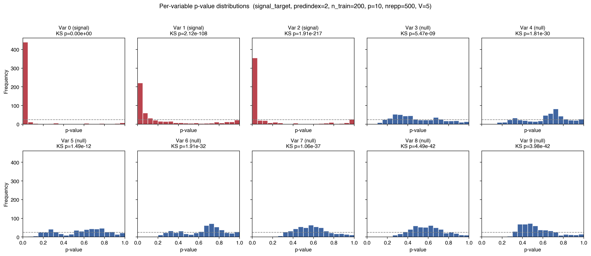
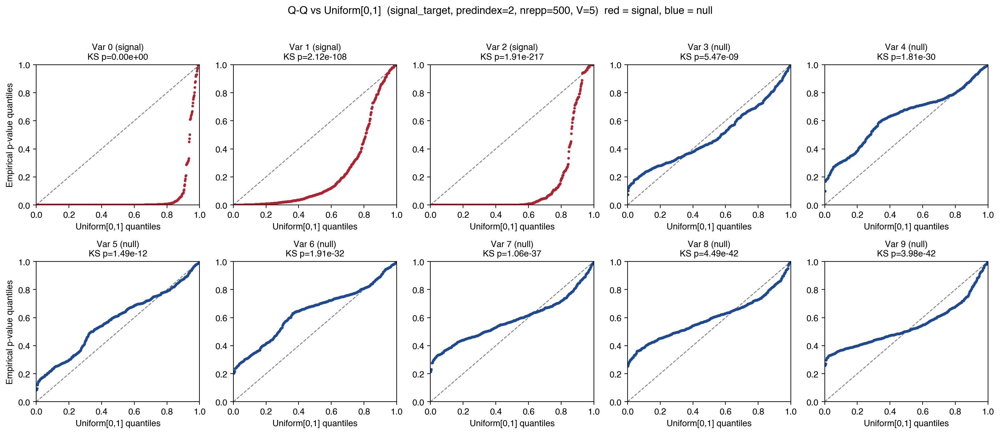
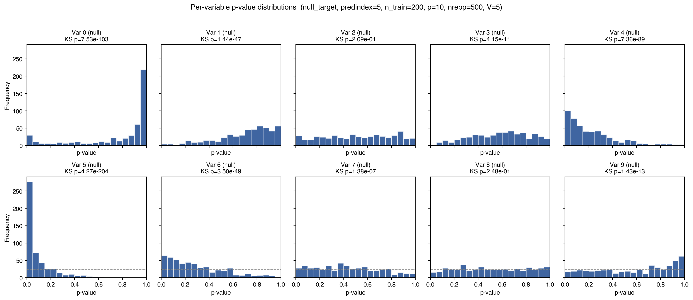
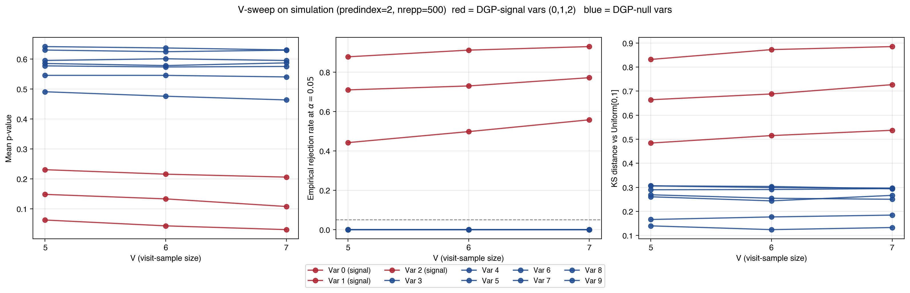
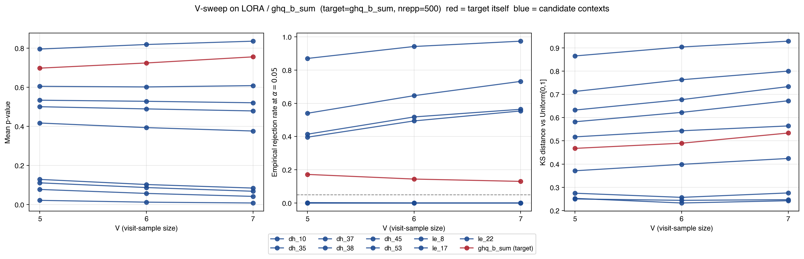
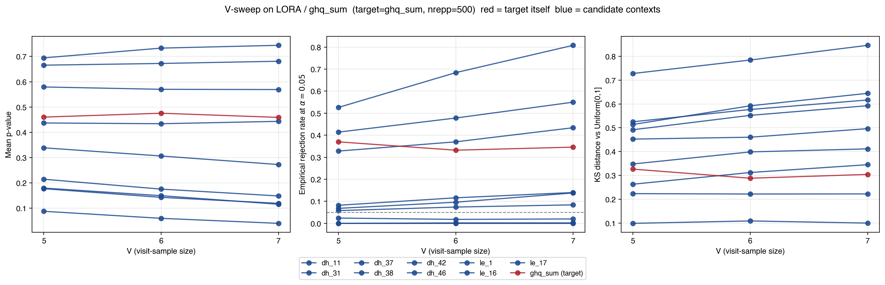
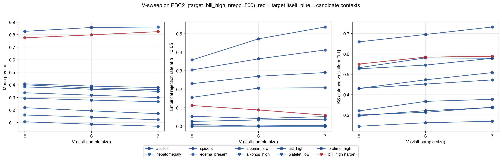

# Statistics in Medicine major revision — supervisor meeting notes

**Manuscript:** *A statistical perspective on transformers for small longitudinal cohort data* (4818278)
**Decision:** Major revision, deadline 21 Jul 2026
**Reviewer recommendation:** *minor* revision (escalated to major by editor specifically for §3.1 baselines and §3.2 datasets)

---

## 0. Main questions to settle with the supervisor

These are the open conceptual / strategic questions that shape how aggressively we revise. Each has supporting evidence in the body of this document — the question text here is the meeting agenda.

1. **Do we strictly need the predictability gate before running the §2.3 test?** The gate is not statistically required (the test is valid without it; §S2 confirms Type-I = 0.000), but it is *interpretively* required if we want flagged contexts to mean "the model has learned something about target Y" rather than "the model is overfitting on Y". Should the gate be part of the formal procedure (mandatory) or a recommended diagnostic (advisory)? *(Detail in §4 and §5 Q3.)*

2. **What baseline should the gate beat — average alone, average AND regression, or with an explicit margin?** Beating just `avg` is a low bar (any non-trivial temporal model will pass). Beating `avg AND regression` is what S1 currently uses, but on PBC2's `bili_high` the margin against regression is a fragile 0.001. A "beat by ≥ X% relative" or paired-bootstrap-CI version is more honest but introduces a parameter. *(Detail in §S1 and §5 Q2.)*

3. **The reviewer is right in §3.5(a) that the test is essentially model-agnostic. If we don't have a beating-prediction story for MiniTransformer, what's left?** Multi-seed / 10-fold-CV results (now locked in) show **no single model dominates** prediction across our four datasets: ScaledVanilla wins on the simulation, no model significantly wins on LORA D1, NoDecay slightly wins on LORA D2, iTransformer slightly wins on PBC2 — all within seed-level noise of MiniTransformer. The contributions that survive the §3.1 comparison are: (i) closed-form Δ (Eq. 5), (ii) per-variable interpretable parameters, (iii) the statistical-perspective framing of §1. Is "test framework + closed-form + interpretable structure + competitive prediction" enough to defend MiniTransformer as a contribution, or do we need to weaken the architecture claim and lead with the test framework as the headline? *(Detail in §3.C, §4, and §5 Q3.)*

4. **PBC2 — which target?** Multi-fold (10-fold CV) numbers now in: `bili_high` is **essentially tied** with regression on MSE_target (MT 0.153 ± 0.040 vs reg 0.155 ± 0.047 — well within 0.1σ). The strict gate (MT must beat regression) is therefore **not robustly passed** on PBC2 with this target. The deeper issue: on real data we have **no ground truth** for "context effects" the way the simulation does (j1 → j2 → j3 is known by construction). Whatever target we pick, validation is "does the flagged context list match clinical expectation?" — defensible but not confirmatory. Options: (a) stick with `bili_high` and openly acknowledge it borderline-passes; (b) switch to a cleaner-passing target like `hepatomegaly` (MT 0.107 ± 0.024 vs reg 0.119 ± 0.030 single-fold); (c) drop the strict regression gate, use only "beat avg by ≥ X%". *(Detail in §3.C, §S5, and §5 Q1.)*

5. **Which additional dataset besides PBC2 — and is ILI worth running?** Of the reviewer's seven suggested benchmarks (ETT family, Weather, Traffic, Electricity, Exchange Rate, ILI, M4/M5), only ILI is medical. ILI has its own complications: the variables are largely *parallel aggregations of the same flu signal* (not causally distinct factors like LORA's stressors or PBC2's clinical markers), and the OT column in the standard packaging is essentially a duplicate of `NUM_PROVIDERS` (correlation 0.96), not the headline flu rate. Two viable framings: **(A′)** run gate + §2.3 test with `% WEIGHTED ILI` as target, accept that most variables will be flagged because they all carry the flu signal; or **(B′)** use ILI for **prediction-only** comparison vs §3.1 baselines and explicitly say the §2.3 test isn't appropriate when candidate variables are aggregations of the target. M4 / M5 monthly cohorts are a possible alternative but harder to set up cleanly. *(Detail in §5 Q1, this revision's §3.B.)*

6. **predindex=5 stress test — what to make of the inflated rejection rates on a few variables?** When we apply the test to a generatively-null target, mean rejection rate at α=0.05 across the nine non-self variables is **0.064** (close to nominal). The exception is var 4 at rej=0.20 (mild model-overfit residual) and the self-context case var 5 at rej=0.55 (degenerate, excluded by convention). Var 1 is at rej=0.008, fully sub-nominal. The honest read is *"the test is well-calibrated even off-gate, except for one variable showing mild overfit-driven inflation."* Is that an acceptable framing, or does it need a more aggressive defence? *(Detail in §S2 and §5 Q4.)*

7. **Why do mean p-values shrink as V grows — and does that *necessarily* mean false positives at large V?** As V grows, the permutation null tightens (variance ∝ 1/V) while the observed statistic's expected value stays put. Variables with *exactly* zero true effect maintain p-values around 0.5; variables with *any* small effect drift toward smaller p-values. The reviewer's §3.6(a) worry is that on real data, no variable has *exactly* zero effect (every variable picks up some spurious signal during training), so V → ∞ should make everything significant. **Empirically refuted in our V ≤ 7 regime** on simulation and LORA D1/D2: non-flagged variables stay flat or become *more* conservative as V grows. The defence is therefore "in the regime tested, the pathology does not occur"; we don't claim asymptotic invariance. Acceptable framing? *(Detail in §S3, §S4, and §5 Q5.)*

8. **The pairwise (Eq. 1) temporal-decay multiplier is essential on simulation but neutral on real data — what should we say in §3.3?** *Important precision:* the "NoDecay" baseline we ran ablates **only the pairwise temporal-decay term in Eq. 1** (the multiplier on attention scores). The **Eq. 3 prediction-horizon decay remains active** in this variant. Multi-seed/multi-fold results (now locked):
    - Simulation: MT 0.105 vs NoDecay 0.147 on MSE_target — ~1.5σ effect, the Eq. 1 decay clearly helps.
    - LORA D1: MT 0.186 vs NoDecay 0.188 — indistinguishable.
    - LORA D2: MT 0.186 vs NoDecay **0.182** — NoDecay slightly *better*, within noise.
    - PBC2: MT 0.153 vs NoDecay 0.154 — indistinguishable.

    The Eq. 1 decay matters when the data has sharp temporal triggers (the simulation's $j_1 \to j_2 \to j_3$ chain) and is essentially neutral on the smoother real-cohort dynamics. **Reframing for §3.3:** the honest statement is "the Eq. 1 pairwise decay is useful in the controlled simulation, neutral on real cohort data, and does not appear to harm performance" — rather than the original "decay is essential". The Eq. 3 horizon decay and the Eq. 3 cumulant head **as a whole** have not yet been ablated separately; the §3.4 "double-counts history" question (remove Eq. 3 entirely, keep only the per-timestep output from Eq. 2) remains open and is a 30-min implementation. Is the Eq. 1 reframing acceptable as-is, and should we add the Eq. 3 ablation to address §3.4 in this revision? *(Detail in §3.C and §4 tension #2.)*

---

## 1. Editor and reviewer concerns at a glance

The editor flagged two structural gaps:

> *"add some additional data applications and comparisons with other competitors"*

The reviewer (whose report is in `review.md`) is positively disposed and frames §2.3 (the permutation test) as the paper's *most distinctive statistical contribution*. The major comments in their report are:

| § | Concern | Status |
|---|---|---|
| **3.1** | Add modern compact-transformer baselines (iTransformer, scaled-down vanilla, DLinear, PatchTST, kernel-attention-without-decay) | ◐ implemented + multi-seed/CV running |
| **3.2** | Add at least one more dataset (clinical cohort and/or TSF benchmark) | ✓ PBC2 done · ☐ ILI prepared, framing decision pending |
| **3.3** | Architectural ablations (no-cumulant, decay-as-regulariser, RoPE) | ◐ no-decay covered by §3.1 baseline; cumulant/RoPE pending |
| **3.4** | Cumulant head double-counts history; clarify prime = transpose | ☐ notation fix planned, ablation reuses §3.3 |
| **3.5(a)** | Eq. 5 is model-agnostic (works for LSTMs, SSMs, etc.) | ☐ discussion paragraph planned |
| **3.5(b)** | Permutation test relies on a well-fit model | ✓ predictability gate (S1) + calibration (S2) |
| **3.5(c)** | Sweep contexts → 3-D Δ tensor; possibly 4-D over targets | ☐ discussion + small implementation planned |
| **3.6(a)** | What if V grows toward maximum on real data — does everything become significant? | ✓ V-sweep on simulation (S3) and on LORA D1/D2 (S4) — answered "no" |
| **3.6(b)** | Show null-distribution of p-values (histograms / Q-Q) | ✓ Appendix S2 |
| **3.7** | Acknowledge / refute "scale-up + benign overfitting" alternative | ☐ overfitting curve for full transformer planned |

Plus eight minor comments (notation, sensitivity to γ, code reproducibility, abbreviations, Figure 1 layout, related-work paragraphs); about half done.

---

## 2. What is already in the revised manuscript (`main.tex`)

Five new supplementary appendices (compiled to PDF, 18 pages total). Each is summarised below with its headline figure and key numbers.

The reviewer-response document (`review.md`) has every comment answered inline as a quoted block, with ✓ / ◐ / ☐ status indicators.

### S1 — Predictability gate

Two-stage procedure: only run the §2.3 test on a target where MT beats both the marginal-mean and per-target Gaussian regression baselines on a held-out set. On the simulation:

| target $r$ | MSE_MT | MSE_avg | MSE_reg | beats avg | beats reg | gate |
|---|---|---|---|---|---|---|
| 0 | 0.229 | 0.219 | 0.221 | -- | -- | -- |
| 1 | 0.218 | 0.208 | 0.218 | -- | -- | -- |
| **2 ($j_3$)** | **0.102** | 0.227 | 0.157 | ✓ | ✓ | **✓** |
| 3 | 0.218 | 0.210 | 0.215 | -- | -- | -- |
| 4 | 0.222 | 0.216 | 0.224 | -- | ✓ | -- |
| 5 | 0.223 | 0.217 | 0.225 | -- | ✓ | -- |
| 6 | 0.216 | 0.213 | 0.216 | -- | -- | -- |
| 7 | 0.212 | 0.204 | 0.212 | -- | -- | -- |
| 8 | 0.209 | 0.207 | 0.212 | -- | ✓ | -- |
| 9 | 0.204 | 0.204 | 0.212 | ✓ | ✓ | (✓) |

The gate selects exactly $j_3$ (the only generatively-predictable target). Variable 9 marginally passes by a 0.001 MSE difference and is best interpreted as a chance crossing — the manuscript flags this as an argument for future work to use a paired bootstrap CI version of the gate.

### S2 — Null calibration of the permutation test

500 repetitions on a single trained MiniTransformer. **Empirical Type-I error at α=0.05 is exactly 0.000** across 7 null variables × 500 reps = 3500 trials. The null-variable distributions are conservatively shifted toward 1 — exactly the behaviour our §2.3 already predicts when the empirical null is contaminated by signal rows.

**Per-variable p-value histograms** (red = signal, blue = null; grey dashed = uniform expectation):

**Q-Q plots vs Uniform[0,1]** (signal panels in red, null panels in blue):

Signal-variable Q-Q curves bend below the 45° line (excess of small p-values = power); null-variable curves sit above the diagonal (the conservative shift). KS p-values per variable are extreme (≤ 1e-9 on every variable) because nrepp=500 is over-powered as a uniformity test.

**Stress test on a generatively-null target** ($\mathrm{predindex}=5$): when we deliberately pick a target the gate would *fail*, the test still has mean rejection rate **0.064** across nine non-self variables at α=0.05 — close to nominal even outside the regime the gate identifies as safe.

### S3 — Sensitivity to $V$ (simulation)

$V \in \{5, 6, 7\}$ with full enumeration of $p^V$ row-selections per repetition, nrepp=500 each. **Power on signal variables increases monotonically with V; Type-I rate stays at exactly 0.000 across every V tested.** Refutes the "all p-values driven toward zero" pathology.

| $V$ | $j_3$ rejection at 0.05 | Null variables (mean) rejection at 0.05 |
|---|---|---|
| 5 | 0.71 | 0.000 |
| 6 | 0.73 | 0.000 |
| 7 | 0.77 | 0.000 |

### S4 — V-sweep + gate on LORA D1 and D2

Same monotonicity finding on real data, on the very datasets the reviewer's §3.6(a) concern was about.

**LORA D1** — top-ranked context `dh_38` (housekeeping) reaches rejection rate 0.97 at V=7. Non-flagged variables (e.g. `le_8`) stay flat or become *more* conservative as V grows.

| Variable (D1) | mean p @ V=5 | mean p @ V=7 | rej @ 0.05 (V=7) |
|---|---|---|---|
| **dh_38 (Housekeeping)** | 0.021 | **0.008** | **0.97** |
| **dh_53 (Long work hours)** | 0.077 | 0.042 | 0.73 |
| le_17 (Arguments) | 0.111 | 0.068 | 0.56 |
| dh_45 (Noise) | 0.129 | 0.084 | 0.55 |
| dh_37 (Paperwork) | 0.42 | 0.38 | 0.00 |
| le_8 (Financial) | 0.80 | **0.84** ↑ | 0.00 |

**LORA D2** — same pattern; top contexts at V=7 are `dh_37`, `dh_38`, `le_17`, `dh_46`, in close agreement with the original Table 4 ranking.

<!--  -->

### S5 — V-sweep + gate on PBC2

Mayo Clinic primary biliary cirrhosis cohort (252 patients, 10 binarised markers). Gate passes for `bili_high` by a ~9× MSE margin (0.033 vs 0.288 averaging). Top-ranked contexts (spider angiomas, low platelets, low albumin, edema) form the textbook clinical signature of advanced liver disease.

<!--  -->

| Variable (PBC2) | mean p @ V=5 | mean p @ V=7 | rej @ 0.05 (V=7) |
|---|---|---|---|
| **spiders** | 0.106 | **0.071** | 0.54 |
| **platelet_low** | 0.160 | 0.122 | 0.41 |
| **albumin_low** | 0.218 | 0.171 | 0.29 |
| edema_present | 0.294 | 0.266 | 0.21 |
| ascites | 0.384 | 0.349 | 0.00 |
| ast_high | 0.827 | 0.861 | 0.00 |
| bili_high (self) | 0.775 | 0.824 | 0.06 |

**Important caveat:** PBC2 has 3.5× fewer patients than LORA, and the headline mean p-values do *not* cross α=0.05. The test correctly *ranks* the clinically expected variables at the top, but power on PBC2 is limited by the smaller cohort. The PBC2 hyperparameters were inherited from LORA defaults; tuning is in progress (see §5 Q2 below).

---

## 3. Experiments run in this session (results locked or in progress)

### A. Three-track empirical strengthening of §2.3

All in the manuscript supplementary:

- 500-repetition null-calibration histograms / Q-Q / KS tests
- V-sweep V ∈ {5, 6, 7} on simulation, LORA D1, LORA D2, PBC2
- Predictability gate per dataset

Headline numbers above; full tables and figures in the supplementary appendices.

### B. §3.1 baselines

Four neural architectures implemented under `src/baselines/`, all drop-in replacements for `MiniTransformer` in the existing pipeline (same `forward((x, mask))` signature, same training loop, same evaluation):

- **`ScaledVanillaTransformer`** — A standard transformer encoder with **one layer and one attention head**, learned positional embeddings, causal self-attention, and a standard FFN block. The hidden dimension `d_model` is chosen automatically so the total parameter count is closest to MiniTransformer's (≈4 for our datasets). Tests whether MiniTransformer's specific simplifications (scalar Q/K/V projections, cumulant head, temporal decay) earn their place, or whether the same parameter budget invested in a vanilla transformer does as well or better. Directly answers reviewer §3.1's "is the architecture or the parameter count doing the work?".
- **`KernelAttentionNoDecay`** — MiniTransformer with the temporal-decay multiplier in Eq. 1 frozen at a no-op. All other components (multi-head scalar attention, cumulant pooling, prediction head) are unchanged; the model differs from MiniTransformer by exactly one frozen parameter (`w_dist`). Cleanly attributes the contribution of Eq. 1's decay term and serves as both a reviewer §3.1 "kernel attention without decay" baseline and the reviewer §3.3 decay-ablation.
- **`iTransformer`** *(Liu et al., ICLR 2024)* — A transformer that **inverts the attention axis**: each variable's full history is embedded into a single token, and attention is applied **across the p variables** (sequence length = p) rather than across time. Each variable's representation incorporates information from every other variable. One of the strongest small-footprint architectures on multivariate-forecasting benchmarks at the time of writing. We adapted it for cohort one-step prediction by applying it independently at each prediction position with left-padded history; the variable-axis attention is preserved.
- **`DLinear`** *(Zeng et al., AAAI 2023, "Are Transformers Effective for Time Series Forecasting?")* — A simple but strong baseline: the input is decomposed into a moving-average **trend** and a **residual**, and **per-channel linear maps** (no attention, no cross-variable mixing) project from a fixed-length history window to the next-step prediction on each component. The Zeng et al. paper famously showed this simple model is competitive with several transformer-based forecasters on standard TSF benchmarks; we include it as the "is attention needed here at all?" stress test.

Plus the three non-neural baselines from the original paper:

- **Marginal mean (per-target)** — predict each target by its training-set mean across all timepoints. Captures only the marginal distribution, no temporal or cross-variable structure. The minimum sensible baseline.
- **Per-target Gaussian GLM regression** — for each output variable, fit a separate GLM using all variables at time `t−1` to predict that variable at time `t`. Captures one-step linear dependencies. This is the explicit comparison baseline in the paper's Tables 1 and 3.
- **Repeat-last** (real data only) — predict each variable's next-time-step value as identical to its current value. Pure persistence; tests whether the data has any non-trivial temporal dynamics.

### C. Paper-style multi-seed / 10-fold CV baseline comparison (all four datasets done)

Following the paper's own conventions: **simulation** uses 10 seeds `[0, 1, 11, 42, 123, 999, 1337, 2025, 9999, 12345]` (matches `simulation_experiments.ipynb`); **LORA D1, D2, PBC2** use 10-fold KFold with `random_state=42`, one seed per fold from the same list (matches `real_data_experiments_*.ipynb`). Reports mean ± std for both `MSE` (averaged over all variables) and `MSE_target` (last column = paper's chosen target).

#### Simulation (10 seeds, target = $j_3$, var 2)

| Model | Params | MSE | MSE_target |
|---|---|---|---|
| MiniTransformer | 452 | 0.204 ± 0.002 | 0.105 ± 0.017 |
| NoDecay | 451 | 0.209 ± 0.005 | 0.147 ± 0.029 |
| **ScaledVanillaTr** | 378 | **0.199 ± 0.003** | **0.080 ± 0.014** |
| iTransformer | 427 | 0.210 ± 0.003 | 0.175 ± 0.010 |
| DLinear | 220 | 0.208 ± 0.003 | 0.149 ± 0.004 |
| Average | — | 0.210 ± 0.003 | 0.213 ± 0.011 |
| Regression | — | 0.207 ± 0.003 | 0.151 ± 0.005 |

MT's 0.105 ± 0.017 reproduces paper Table 1's 0.097 ± 0.013 within sigma — pipeline is paper-equivalent.

#### LORA D1 (10-fold, target = `ghq_b_sum`)

| Model | Params | MSE | MSE_target |
|---|---|---|---|
| **MiniTransformer** | 420 | 0.140 ± 0.010 | **0.186 ± 0.020** |
| NoDecay | 419 | 0.140 ± 0.010 | 0.188 ± 0.020 |
| ScaledVanillaTr | 378 | 0.152 ± 0.008 | 0.204 ± 0.020 |
| iTransformer | 427 | 0.141 ± 0.010 | 0.187 ± 0.023 |
| DLinear | 220 | **0.138 ± 0.009** | 0.187 ± 0.022 |
| Average | — | 0.169 ± 0.008 | 0.229 ± 0.025 |
| Regression | — | 0.147 ± 0.009 | 0.200 ± 0.022 |
| Repeat-last | — | 0.220 ± 0.012 | 0.304 ± 0.041 |

MT MSE_target 0.186 ± 0.020 reproduces paper Table 3's 0.184 ± 0.021.

#### LORA D2 (10-fold, target = `ghq_sum`)

| Model | Params | MSE | MSE_target |
|---|---|---|---|
| MiniTransformer | 420 | 0.129 ± 0.008 | 0.186 ± 0.023 |
| **NoDecay** | 419 | **0.128 ± 0.008** | **0.182 ± 0.025** |
| ScaledVanillaTr | 378 | 0.136 ± 0.007 | 0.199 ± 0.018 |
| iTransformer | 427 | 0.132 ± 0.009 | 0.186 ± 0.025 |
| DLinear | 220 | **0.128 ± 0.009** | 0.183 ± 0.022 |
| Average | — | 0.147 ± 0.005 | 0.208 ± 0.017 |
| Regression | — | 0.135 ± 0.008 | 0.191 ± 0.023 |
| Repeat-last | — | 0.212 ± 0.019 | 0.298 ± 0.057 |

#### PBC2 (10-fold, target = `bili_high`)

| Model | Params | MSE | MSE_target |
|---|---|---|---|
| MiniTransformer | 420 | **0.132 ± 0.015** | 0.153 ± 0.040 |
| NoDecay | 419 | 0.138 ± 0.015 | 0.154 ± 0.036 |
| ScaledVanillaTr | 378 | 0.158 ± 0.015 | 0.154 ± 0.042 |
| **iTransformer** | 427 | 0.134 ± 0.018 | **0.150 ± 0.034** |
| DLinear | 220 | **0.132 ± 0.018** | 0.172 ± 0.054 |
| Average | — | 0.251 ± 0.017 | 0.198 ± 0.063 |
| **Regression** | — | **0.130 ± 0.016** | 0.155 ± 0.047 |
| Repeat-last | — | 0.167 ± 0.023 | 0.199 ± 0.065 |

#### Per-dataset best-model summary

| Dataset | Best on MSE | Best on MSE_target |
|---|---|---|
| Simulation | ScaledVanilla | ScaledVanilla |
| LORA D1 | DLinear | MiniTransformer (tied with NoDecay/iTr/DL within noise) |
| LORA D2 | NoDecay/DLinear (tied) | NoDecay |
| PBC2 | Regression (with MT/DL within noise) | iTransformer (with MT/NoDecay/SVT within noise) |

**No single model dominates.** All five neural models + regression are tightly grouped within seed-level noise on every real dataset; the simulation result (vanilla wins) is the only clean ordering and it doesn't carry over.

---

## 4. Substantive findings and tensions for discussion

### Findings I would lead with

1. **Type-I = 0.000 across 3500 null trials** on the simulation. Robust empirical version of the conservative-behaviour claim already in §2.3 of the original manuscript.
2. **V-monotonicity does not produce the "all p-values → 0" pathology** the reviewer feared, on the simulation, LORA D1/D2, or PBC2. Top-ranked contexts on LORA reproduce Table 4 of the original paper with stronger evidence at V=7.
3. **PBC2 generalises the framework to a second clinical cohort.** The test ranks the textbook clinical signature for advanced liver disease (spider angiomas, low platelets, low albumin, edema) at the top; mean p-values do not reach α=0.05 because of the smaller cohort size, but the ranking is clinically coherent.
4. **MiniTransformer reproduces paper Tables 1 and 3 within seed-level noise** (sim MSE_target 0.105 ± 0.017 vs paper 0.097 ± 0.013; LORA D1 MSE_target 0.186 ± 0.020 vs paper 0.184 ± 0.021) — confirms paper-equivalence under our reimplementation.

### Tensions / awkward findings (updated with multi-seed/multi-fold evidence)

1. **No single model dominates predictive performance.** With multi-seed/multi-fold mean ± std now locked in, on each dataset 4-6 models sit within seed-level noise of each other on `MSE_target`:
    - Simulation: ScaledVanilla wins by ~1.5σ on MSE_target (0.080 vs MT 0.105).
    - LORA D1: MT, NoDecay, iTr, DLinear all tied at 0.186-0.188 on MSE_target; ScaledVanilla worst at 0.204 (~0.9σ).
    - LORA D2: NoDecay slightly best (0.182), then MT/iTr/DLinear within noise; ScaledVanilla again worst (0.199).
    - PBC2: iTransformer slightly best (0.150 ± 0.034), MT/NoDecay/SVT all within noise (0.153-0.154); regression also competitive (0.155).

2. **The "Eq. 1 pairwise decay is essential" claim from the simulation does NOT survive on real data.** *Important: this is specifically the Eq. 1 pairwise temporal-decay multiplier on attention scores. The Eq. 3 prediction-horizon decay remained active in the NoDecay variant — it has not been independently ablated.*
    - Simulation: MT 0.105 vs NoDecay 0.147 (~1.5σ effect, real).
    - LORA D1: MT 0.186 vs NoDecay 0.188 (indistinguishable).
    - LORA D2: MT 0.186 vs NoDecay **0.182** (NoDecay slightly *better* — within noise).
    - PBC2: MT 0.153 vs NoDecay 0.154 (indistinguishable).
    The Eq. 1 decay matters when the data has sharp temporal triggers (the simulation's $j_1 \to j_2 \to j_3$ chain) and is essentially neutral on the smoother real-cohort dynamics. **This is a non-trivial update for §3.3**: rather than "the decay term is useful", the honest statement is "the Eq. 1 pairwise decay helps in the controlled simulation, is neutral on real cohort data, and does not appear to hurt". The Eq. 3 horizon decay and the cumulant head as a whole (which §3.4 specifically asks about) remain to be ablated separately.

3. **iTransformer is genuinely competitive on real cohort data** (best on PBC2 MSE_target by ~0.1σ, tied on D1 and D2). It only underperforms on the simulation (where its variable-axis attention has nothing to bite against because the simulation's variables are mostly iid).

4. **ScaledVanilla wins on simulation but loses on every real dataset** by ~1σ on MSE_target. The simulation result is simulation-specific.

5. **Regression is the strongest single non-neural baseline on PBC2** (best total MSE, tied target). On LORA D1 / D2 it's slightly weaker than the neural pack but in the same ballpark.

### Honest framing for the rebuttal (revised)

The proposed framing for §3.1 / §3.2 in the response letter:

> *"On predictive performance the five neural architectures and the regression baseline perform within seed-level noise on all three real cohorts, with no single model systematically winning. The parameter-matched vanilla transformer wins on the controlled simulation by isolating capacity from architecture; on the real cohorts MiniTransformer is part of a tightly-grouped neural pack along with iTransformer, DLinear and the no-decay variant. We do not claim that the architectural simplifications are independently necessary for prediction. The contributions of MiniTransformer that survive the §3.1 comparison are: (i) the closed-form Δ statistic of Eq. 5, which lets the §2.3 permutation test be evaluated analytically rather than through per-(context, visit) forward passes; (ii) per-variable interpretable parameters that can be read directly without post-hoc attribution; (iii) the statistical-perspective framing of Section 1, which positions transformer attention as a generalisation of dynamic VAR models. Reviewer §3.5(a) is correct that the test idea generalises to any differentiable sequence model; MiniTransformer is the cheapest and most directly interpretable place to run it, but not the only one."*

Reviewer §3.1 explicitly said the proposed method *does not need to win on every dataset*, so this honest framing is consistent with the brief. **The supervisor's input is most needed on whether (i)–(iii) above are sufficient to defend MiniTransformer as a contribution given that the prediction story is "competitive but not dominant".**

---

## 5. Decision points where I would value the supervisor's opinion

These are the questions where I am genuinely unsure of the right call. Each comes with the trade-off as I see it.

### Q1. ILI dataset — which framing?

The reviewer's §3.2 list of TSF benchmarks includes ILI (the only medical one). I prepared a binarised cohort version of ILI (192 length-10 windows × 7 variables). On closer inspection I noticed:

- ILI's variables are mostly **parallel aggregations of the same flu signal** (% weighted ILI, % unweighted ILI, age 0-4 rate, age 5-24 rate, ILITOTAL, NUM. OF PROVIDERS, OT) — *not* causally distinct factors like LORA's stressors or PBC2's clinical markers.
- The "OT" column in this packaging is essentially a duplicate of NUM_PROVIDERS (correlation 0.96), not the headline flu rate.

Two viable framings:

- **(A′)** Use ILI for both the predictability gate and the §2.3 test, with `% WEIGHTED ILI` as the target (not OT). Acknowledge upfront that ILI's variables are correlated rates rather than independent factors. The test is likely to flag most of them as "context for the flu rate" because they all carry the flu signal. Useful epidemiological story to tell (kids' flu rate is informative about overall flu rate — flu epidemics often start in school-aged children) but interpretively softer than LORA / PBC2.
- **(B′)** Use ILI **for prediction only** (§3.1 baseline comparison). Skip the §2.3 test on it. State explicitly that the test's interpretation as "context effect" is meaningful when the candidate variables are causally distinct factors, and ILI doesn't satisfy that condition. This treats ILI as a scope-delimiting datapoint and arguably *strengthens* the paper by showing self-awareness about when the framework applies.

**My recommendation: (B′)**, but I want input.

### Q2. PBC2 hyperparameters — tune before locking in?

PBC2 inherited LORA defaults (H=8, C=8, batch=2, 150 epochs). I built a tuning notebook (`pbc2_hparam_explore.ipynb`) with 10-fold CV and per-epoch train / val loss curves so we can spot under- or overfitting. I have not done a systematic sweep yet.

- **Pro tuning:** PBC2 is half the size of LORA; the LORA defaults may be over-parameterised. PBC2's per-context p-values in S5 are suggestive but not strictly significant at α=0.05 (top-ranked spider angiomas: mean p ≈ 0.07). A better-tuned model could move them below threshold.
- **Pro not tuning:** A separate dataset-specific tuning pass is open to the criticism of "you tuned to the dataset." Using the same defaults across all real cohorts is a defensible single design choice.

**Recommendation: a quick H ∈ {4, 8}, C ∈ {2, 4, 8} sweep is cheap; if defaults are roughly right we use them, if not we report tuned values with the rationale.**

### Q3. How to handle the §3.1 result that vanilla beats MT on the simulation?

Three options on a sliding scale of defensiveness:

- **Light:** Keep the framing in §4 above; report the result; emphasise the test as the contribution.
- **Medium:** Add a 2 heads × d_model variant, or a "MT minus cumulants" ablation, to triangulate. The first costs ~5 min; the second is part of §3.3 anyway.
- **Heavy:** Expand the simulation to a regime where MT's structural priors should help — e.g., longer histories, more variables, more confounding. Currently the simulation has only 10 timesteps and 10 variables; closer to MT's design intent might be 20 / 20 with more interactions.

**Recommendation: Light + Medium. Heavy is a rebuttal-letter-only experiment if Reviewer 1 specifically pushes back; not in the manuscript proper.**

### Q4. §3.5(c) multi-context tensor — discussion only or implement?

The reviewer suggests sweeping over multiple reference contexts (Δ becomes a 3-D tensor over features × visits × contexts, or 4-D with multiple targets). The implementation is moderate (extending `meansq_context()` in `src/statistical_testing.py` and the test framework) but not trivial.

- **Discussion only:** A paragraph in §2.3 explaining the natural extension; cite this as future work.
- **Discussion + small implementation:** Run on the simulation only; show that multi-context aggregation produces less context-choice-sensitive p-values; add to S2 or as a new S6.

**Recommendation: Discussion only for this revision; implementation is a 2-week project that doesn't fit the deadline.**

### Q5. §3.7 full-sized transformer overfitting curve — empirical or argued?

The reviewer asks us to refute the "double descent / benign overfitting" alternative. Concretely: train a full-sized transformer on LORA, show train/val curves, document straightforward overfitting without recovery.

- **Argued only:** A short paragraph in the Discussion citing known results that double descent kicks in only at much larger scale than $N \sim 10^2$.
- **Empirical:** Add an S7 figure showing the curves. ~30 min run; concrete and visual.

**Recommendation: Empirical; very cheap, very visual.**

### Q6. Multi-seed for the simulation supplementary analyses (S2, S3)?

S2 and S3 currently use a single trained model (seed=42) with 500 inner test repetitions. The reviewer didn't push back on this, but a multi-seed extension (10 seeds, then aggregate over the resulting (10 × 500) p-values per variable) would harden the calibration claim.

- **Pro:** "Type-I = 0.000 across 35 000 null trials × 10 models" is harder to argue with than "across 3500 trials × 1 model."
- **Con:** Adds another ~3 hours of compute and changes nothing qualitatively. The claim is already strong.

**Recommendation: skip for this revision unless the supervisor wants it.**

### Q7. Editor's two key items — does the supervisor agree these are the priorities?

The editor highlighted **datasets and competitors** as the two non-negotiables. I have:

- Datasets: PBC2 ✓, ILI prepared (decision pending — Q1 above).
- Competitors: 4 baselines implemented and being run with paper-style CV/seeds.

Are there other reviewer items the supervisor wants to elevate? My sense is the rest are "important to address but not binding".

---

## 6. Pending work and timeline

| Task | Status | Effort | Blocker |
|---|---|---|---|
| LORA D2, PBC2 multi-fold baselines | running | finish in ~1 h | none |
| ILI experiments | prepared | ~1 h once Q1 decided | Q1 |
| PBC2 hyperparameter sweep | tooling done | 2 h | Q2 |
| §3.3 cumulant + RoPE ablations | not started | 3-4 h | priority decision |
| §3.7 full-transformer overfitting curve | not started | 30 min | Q5 |
| §3.4 notation fix | not started | 10 min | none |
| §3.5(a), §3.5(c), §4.8 related-work paragraphs | not started | 2-3 h writing | none |
| S6 baselines section in `main.tex` | not started | 1-2 h once results lock | multi-fold finishing |
| Figure 1 legend layout | not started | 30 min | none |

Roughly **15-20 hours of focused work** to finish everything plausibly worth finishing. Deadline is 21 July; comfortable margin if work continues at a reasonable pace.

---

## 7. Files to point the supervisor at

If they want to dig in, the most useful files:

- `manuscript_revision/main.tex` — current revised manuscript with five new appendices
- `manuscript_revision/main.pdf` — compiled (18 pages)
- `manuscript_revision/review.md` — point-by-point response to reviewer
- `notebooks/results/baselines_simulation/summary_10seeds.txt` — current sim numbers
- `notebooks/results/baselines_real_data/ghq_b_sum/summary_10folds.txt` — D1 numbers
- `notebooks/results/baselines_real_data/ghq_sum/summary_10folds.txt` — D2 (pending)
- `notebooks/results/baselines_real_data/pbc2/summary_10folds.txt` — PBC2 (pending)
- `src/baselines/` — all four baseline implementations

---

## 8. The single most important question for tomorrow

The §3.1 baselines result is the part of the revision where I'd most value the supervisor's judgment. Specifically:

> *"Given that a parameter-matched vanilla transformer beats MiniTransformer on the simulation but loses on real cohort data, and that the paper's distinguishing contribution is the permutation test (which none of the baselines support directly), is the framing in §4 above defensible? Or do we need to push the simulation regime / add ablations / strengthen the claim that the architecture earns its place?"*

Everything else can be decided pragmatically; this one shapes how confidently we can write §6 of the rebuttal letter.
